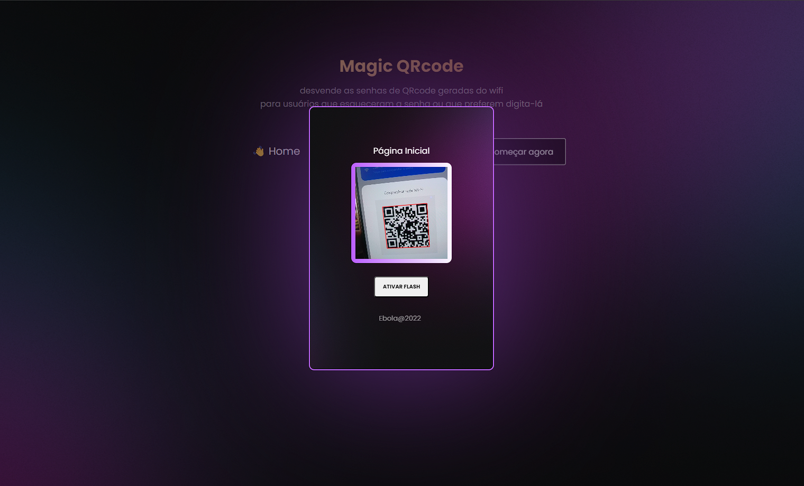

# Qrcode-project

QRcode reading project aimed at unlocking passwords and messages contained in the qrcode.

## Project Setup

```sh
yarn install
```

### Compile and Hot-Reload for Development

```sh
yarn dev
```

### Compile and Minify for Production

```sh
yarn build
```

### Run Unit Tests with [Vitest](https://vitest.dev/)

```sh
yarn test:unit
```

### Lint with [ESLint](https://eslint.org/)

```sh
yarn lint
```
